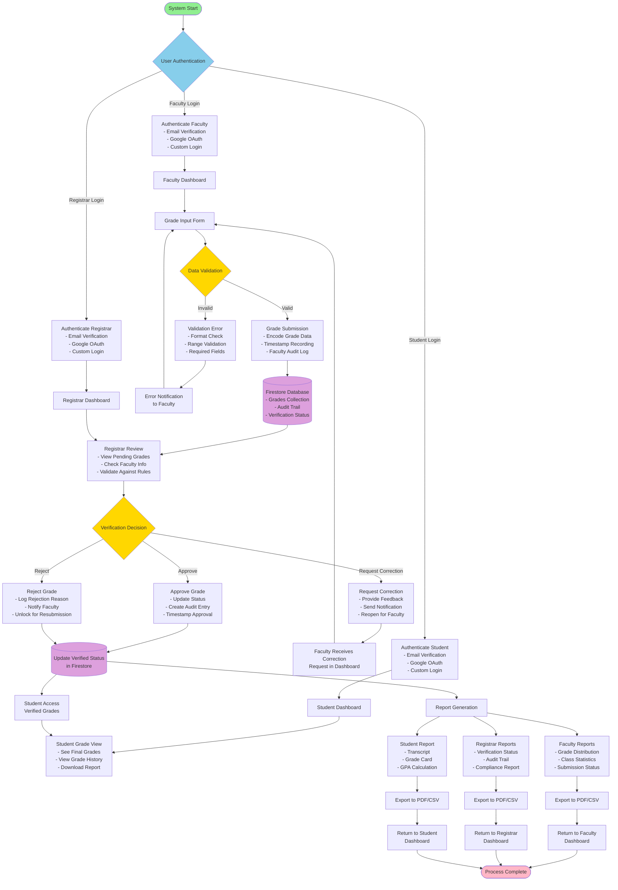
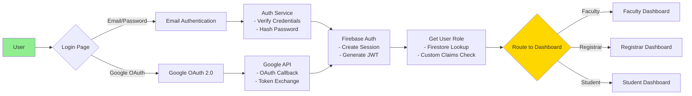
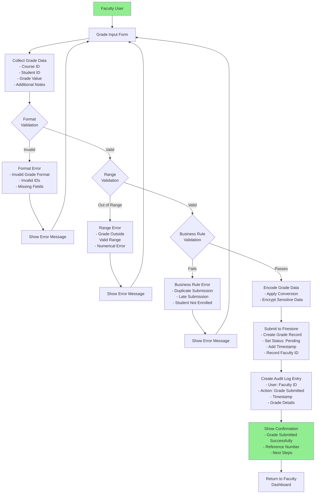
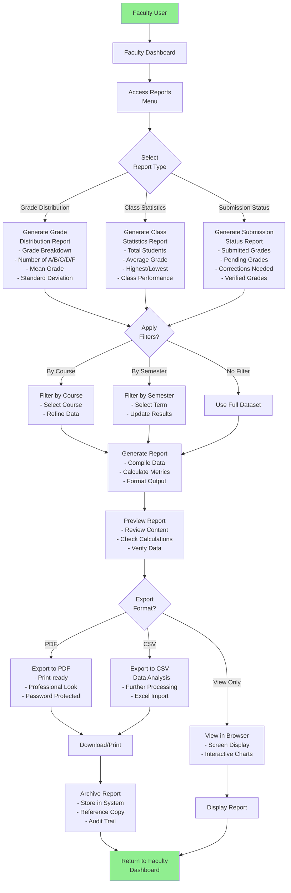
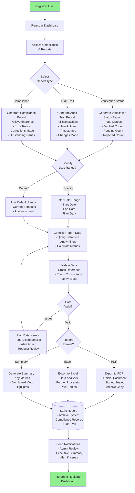

# Integrated Business Process (IBP) Diagram

## Grades and Assessment Management System - Complete Workflow

This document provides a comprehensive Integrated Business Process diagram showing how all subsystems (Faculty, Registrar, and Student) work together through authentication, grade submission, verification, validation, and report generation.

---

## Complete System IBP Workflow



---

## Authentication Flow (IBP Component 1)



---

## Grade Submission & Validation Flow (IBP Component 2)



---

## Verification & Correction Flow (IBP Component 3)

```mermaid
graph TD
    Registrar[Registrar User] --> ViewPending[View Pending Grades<br/>- Filter by Status<br/>- Sort by Faculty<br/>- Search Options]
    
    ViewPending --> GradeDetail[View Grade Details<br/>- Student Info<br/>- Course Info<br/>- Grade Value<br/>- Faculty Info<br/>- Submission Date]
    
    GradeDetail --> ComplianceCheck{Compliance<br/>Check}
    
    ComplianceCheck -->|Issues Found| Issues[Check Issues<br/>- Policy Violations<br/>- Data Anomalies<br/>- Missing Documentation]
    Issues --> ReviewIssues[Review with Faculty<br/>- Document Issue<br/>- Mark for Correction<br/>- Add Comments]
    
    ReviewIssues --> ReqCorrection[Request Correction<br/>- Send Notification<br/>- Status: Correction Requested<br/>- Create Correction Record]
    
    ReqCorrection --> FacNotif[Faculty Receives<br/>Correction Request<br/>- Dashboard Alert<br/>- Email Notification]
    
    FacNotif --> FacReview[Faculty Reviews<br/>- See Issues<br/>- Understand Requirements]
    
    FacReview --> FacSubmit[Resubmit Corrected<br/>Grade]
    
    FacSubmit --> ReverifyProcess{Re-verify<br/>Grade}
    
    ReverifyProcess -->|Still Issues| ReviewIssues
    ReverifyProcess -->|Resolved| Approved1[Grade Approved<br/>- Status: Verified<br/>- Create Approval Record]
    
    ComplianceCheck -->|Pass| Approved1
    
    Approved1 --> FinalAudit[Final Audit Entry<br/>- Action: Grade Verified<br/>- Registrar ID<br/>- Approval Timestamp<br/>- Final Status]
    
    FinalAudit --> StudentNotif[Notify Student<br/>- Grade Now Final<br/>- Available in Portal<br/>- Email Confirmation]
    
    StudentNotif --> UpdateDB[(Update Firestore<br/>- Verified Status<br/>- Audit Trail<br/>- Timestamps)]
    
    UpdateDB --> RegDashReturn[Return to Registrar<br/>Dashboard]
    
    style Registrar fill:#90EE90
    style Approved1 fill:#90EE90
    style RegDashReturn fill:#90EE90
```



---

## Student Grade Access & Report Flow (IBP Component 4)

```mermask
graph TD
    Student[Student User] --> StuDash[Student Dashboard]
    
    StuDash --> GradeView{View Grades}
    
    GradeView -->|Current Semester| CurrentGrades[Display Current<br/>Semester Grades<br/>- Course Name<br/>- Grade Value<br/>- Credit Hours<br/>- GPA Impact]
    
    GradeView -->|Grade History| HistoryGrades[Display Grade<br/>History<br/>- All Semesters<br/>- Semester GPA<br/>- Cumulative GPA<br/>- Trends]
    
    CurrentGrades --> ReportOption{Generate<br/>Report?}
    HistoryGrades --> ReportOption
    
    ReportOption -->|Yes| SelectReport{Report<br/>Type}
    ReportOption -->|No| ViewEnd([Back to Dashboard])
    
    SelectReport -->|Transcript| Transcript[Generate Transcript<br/>- Student Details<br/>- All Grades<br/>- GPA Calculation<br/>- Institution Seal]
    
    SelectReport -->|Grade Card| GradeCard[Generate Grade Card<br/>- Current Semester<br/>- Course Details<br/>- Grade Scale<br/>- Due Dates if Any]
    
    SelectReport -->|GPA Report| GPAReport[Generate GPA Report<br/>- Semester GPA<br/>- Cumulative GPA<br/>- GPA Trends<br/>- Academic Standing]
    
    Transcript --> Format{Export<br/>Format}
    GradeCard --> Format
    GPAReport --> Format
    
    Format -->|PDF| PDF[Export to PDF<br/>- Professional Format<br/>- Ready to Print<br/>- Digitally Signed]
    
    Format -->|CSV| CSV[Export to CSV<br/>- Spreadsheet Format<br/>- Data Portable<br/>- Excel Compatible]
    
    PDF --> Download[Download File<br/>- Browser Download<br/>- Save Locally]
    CSV --> Download
    
    Download --> Share{Share<br/>Report?}
    
    Share -->|Email| EmailShare[Email Report<br/>- Self-addressed<br/>- Share with Advisor<br/>- Share with Family]
    
    Share -->|No| ViewEnd
    EmailShare --> ViewEnd
    
    style Student fill:#90EE90
    style ViewEnd fill:#FFB6C6
```

---

## Faculty Report Generation Flow (IBP Component 5)



---

## Registrar Report & Compliance Flow (IBP Component 6)



---

## Key IBP Process Characteristics

### Integration Points
1. **Authentication Hub**: All users authenticate through centralized system
2. **Grade Lifecycle**: Clear progression from submission → validation → verification → access
3. **Audit Trail**: Every action recorded across all subsystems
4. **Data Consistency**: Single source of truth in Firestore
5. **Notification System**: Automated alerts across all stakeholders

### Business Rules Enforced
- Faculty can only submit grades for their own courses
- Registrar can only verify grades (cannot edit)
- Students can only view their own grades
- All corrections tracked with full audit trail
- Compliance validations at each stage

### Performance Considerations
- Asynchronous processing for report generation
- Real-time status updates for grade verification
- Batch processing for large report generation
- Cache management for frequently accessed reports

### Security Measures
- Role-based access control (RBAC)
- End-to-end encryption for sensitive data
- Complete audit trail for compliance
- JWT token-based authentication
- Firebase security rules enforcement

---

## Process Metrics & KPIs

| Metric | Target | Description |
|--------|--------|-------------|
| **Grade Submission Time** | < 5 min | Time to submit a grade from input |
| **Validation Processing** | < 2 sec | Real-time validation response |
| **Verification Turnaround** | 24-48 hrs | Time to verify submitted grades |
| **Report Generation** | < 30 sec | Generate reports on demand |
| **System Availability** | 99.5% | Uptime requirement |
| **Data Accuracy** | 99.9% | Error rate in grade processing |

---

## Document Links
- [Architecture Overview](ARCHITECTURE.md)
- [Implementation Guide](IMPLEMENTATION_GUIDE.md)
- [Grades Subsystem Documentation](GRADES_SUBSYSTEM_DOCUMENTATION.md)
- [Firebase Integration](FIREBASE_INTEGRATION.md)
- [Error Handling Specs](ERROR_HANDLING_SPECS.md)
